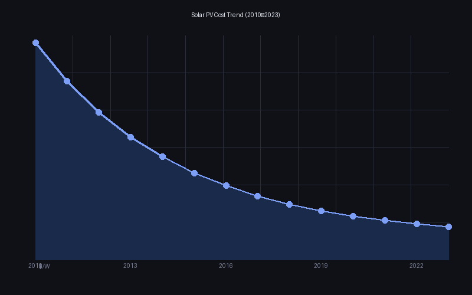
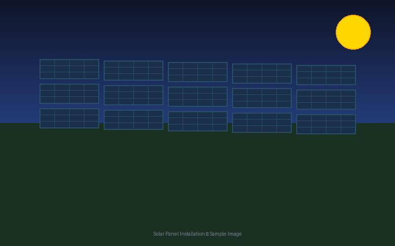

#+OPTIONS: num:nil toc:nil ^:nil title:nil html-postamble:t

#+TITLE: 気候変動と持続可能なエネルギー
#+SUBTITLE: 現状・課題・展望
#+AUTHOR: 山田太郎
#+EMAIL: 大日本大学
#+DATE: 2026-02-19 @ 気象学会大会 

* はじめに

このプレゼンはサンプルです。
内容に意味がありません。
それっぽいことが書かれていますが、すべて適当なものです。

* 気候変動の現状
本節では、気候変動の現状について説明する。

** 地球温暖化の進行

産業革命以降、地球の平均気温は約1.2℃上昇した。
このペースが続けば、2100年までに3〜5℃の上昇が予測されている。

- CO₂濃度は280ppm（産業革命前）から420ppm超に増加
- 海面上昇は過去100年で約20cm
- 北極海の夏季海氷面積は1979年比で約40%減少

*** 各国の気候変動指数

#+ATTR_HTML: :class x-wide
#+CAPTION: 世界各国の気候変動指標（2020年代）
#+NAME: tab:climate
| 国名         | 地域       | CO₂排出量(億t) | 再エネ比率(%) | 平均気温上昇(℃) | 海面上昇(mm) | 森林面積変化(%) | EV普及率(%) | 石炭依存度(%) | カーボン税($/t) |
|--------------+------------+----------------+---------------+-----------------+--------------+-----------------+-------------+---------------+----------------|
| 日本         | アジア     |           10.4 |          22.4 |             1.3 |         12.3 |            -0.2 |         3.2 |          31.0 |            0.0 |
| 中国         | アジア     |          114.7 |          29.8 |             1.5 |         15.1 |            +2.3 |         8.9 |          56.2 |            8.0 |
| インド       | アジア     |           29.8 |          20.1 |             1.4 |         14.2 |            +0.8 |         1.2 |          44.3 |            0.0 |
| 韓国         | アジア     |            6.1 |          12.3 |             1.4 |         13.8 |            -0.1 |         9.0 |          35.2 |            0.0 |
| ドイツ       | ヨーロッパ |            6.7 |          46.2 |             1.8 |         11.2 |            -1.2 |        17.8 |          15.3 |           55.0 |
| フランス     | ヨーロッパ |            3.1 |          24.8 |             1.7 |         10.8 |            +0.3 |        15.3 |           2.1 |           45.0 |
| イギリス     | ヨーロッパ |            3.4 |          42.1 |             1.6 |         11.5 |            +0.5 |        16.9 |           2.3 |           50.0 |
| スウェーデン | ヨーロッパ |            0.4 |          66.3 |             2.1 |          9.8 |            +1.2 |        32.4 |           0.5 |          130.0 |
| 米国         | 北米       |           47.1 |          21.5 |             1.5 |         13.4 |            -0.8 |         7.2 |          20.1 |            0.0 |
| カナダ       | 北米       |            5.7 |          68.4 |             2.3 |         14.1 |            -1.5 |         8.1 |           4.2 |           65.0 |
| ブラジル     | 南米       |            4.9 |          83.2 |             1.6 |         16.3 |            -3.8 |         1.8 |           3.2 |            0.0 |
| オーストラリア | オセアニア |            3.9 |          32.4 |             1.8 |         14.8 |            -0.9 |         3.8 |          50.1 |            0.0 |
| 日本         | アジア     |           10.4 |          22.4 |             1.3 |         12.3 |            -0.2 |         3.2 |          31.0 |            0.0 |
| 中国         | アジア     |          114.7 |          29.8 |             1.5 |         15.1 |            +2.3 |         8.9 |          56.2 |            8.0 |
| インド       | アジア     |           29.8 |          20.1 |             1.4 |         14.2 |            +0.8 |         1.2 |          44.3 |            0.0 |
| 韓国         | アジア     |            6.1 |          12.3 |             1.4 |         13.8 |            -0.1 |         9.0 |          35.2 |            0.0 |
| ドイツ       | ヨーロッパ |            6.7 |          46.2 |             1.8 |         11.2 |            -1.2 |        17.8 |          15.3 |           55.0 |
| フランス     | ヨーロッパ |            3.1 |          24.8 |             1.7 |         10.8 |            +0.3 |        15.3 |           2.1 |           45.0 |
| イギリス     | ヨーロッパ |            3.4 |          42.1 |             1.6 |         11.5 |            +0.5 |        16.9 |           2.3 |           50.0 |
| スウェーデン | ヨーロッパ |            0.4 |          66.3 |             2.1 |          9.8 |            +1.2 |        32.4 |           0.5 |          130.0 |
| 米国         | 北米       |           47.1 |          21.5 |             1.5 |         13.4 |            -0.8 |         7.2 |          20.1 |            0.0 |
| カナダ       | 北米       |            5.7 |          68.4 |             2.3 |         14.1 |            -1.5 |         8.1 |           4.2 |           65.0 |
| ブラジル     | 南米       |            4.9 |          83.2 |             1.6 |         16.3 |            -3.8 |         1.8 |           3.2 |            0.0 |
| オーストラリア | オセアニア |            3.9 |          32.4 |             1.8 |         14.8 |            -0.9 |         3.8 |          50.1 |            0.0 |

これは列数が多くて行数も多い大きな表。

*** 極端気象の増加

気温上昇に伴い、極端な気象現象の頻度と強度が増している。

#+CAPTION: 極端気象の増加
| 現象       | 頻度の変化 | 強度の変化 |
|------------+------------+------------|
| 熱波       | +2〜3倍    | +1〜3℃    |
| 大雨・洪水 | +1.5倍     | +7%/℃     |
| 干ばつ     | 地域差大   | 長期化傾向 |
| 台風・ハリケーン | やや増加 | 強化傾向 |

#+begin_notes
表の数値はIPCC第6次評価報告書より。
#+end_notes

*** 生態系への影響

気候変動は生物多様性にも深刻な影響を与えている。

- サンゴ礁：海水温上昇により白化現象が深刻化
- 生息域の移動：多くの種が極方向・高地方向へ移動
- 季節のズレ：開花・渡り・産卵タイミングの乱れ

** ティッピングポイントのリスク

一定の閾値を超えると不可逆的な変化が連鎖する「ティッピングポイント」が存在する。

- 西南極氷床の崩壊（→海面6m上昇）
- アマゾン熱帯雨林のサバンナ化
- 永久凍土の融解によるメタン放出

* 再生可能エネルギーの現状と課題

** 太陽光・風力の急速な普及

再生可能エネルギーのコストは過去10年で劇的に低下した。

#+CAPTION: 太陽光発電のコスト

- 太陽光発電コスト：2010年比で約90%減
- 風力発電コスト：同約70%減
- 2023年の世界新規電力設備の約80%が再エネ

*** 太陽光発電の技術動向

#+CAPTION: 太陽光パネルの設置例

次世代技術として注目されているもの：

1. ペロブスカイト太陽電池（変換効率29%超を達成）
2. タンデム型セル（シリコン+ペロブスカイト）
3. 建材一体型（BIPV）

*** 洋上風力の拡大

洋上風力は陸上に比べ風況が安定しており、大型化が進んでいる。

- 最大タービン出力：現在22MW（ブレード長130m超）
- 浮体式洋上風力により深海域も開発可能に
- 日本は2030年までに10GW導入目標

** 蓄電・グリッドの課題

再エネの最大の課題は出力変動への対応である。

[[./sources/grid_explain.mp4][グリッド安定化の仕組み（動画）]]

主な対策：

- 大型蓄電池（リチウムイオン・全固体・フロー電池）
- 需要側制御（デマンドレスポンス）
- 広域連系・国際送電網
- Power-to-X（余剰電力の水素・合成燃料変換）

* 政策と社会変容

** 国際的な政策動向

パリ協定以降、各国の政策は大きく加速している。

| 地域       | 目標               | 主な施策               |
|------------+--------------------+------------------------|
| EU         | 2050年カーボンニュートラル | ETS強化・国境炭素税 |
| 米国       | 2050年ネットゼロ   | IRA（インフレ抑制法）  |
| 中国       | 2060年カーボンニュートラル | 再エネ大規模投資 |
| 日本       | 2050年カーボンニュートラル | GX推進法・電力市場改革 |

** 市民・企業の役割

政府だけでなく、企業と市民の行動変容も不可欠である。

企業の動き：

- RE100（再エネ100%）参加企業が400社超
- SBT（科学的根拠に基づく排出削減目標）設定が急増
- ESG投資の主流化

市民の行動：

- 電力会社の選択（再エネプラン）
- EV・ヒートポンプへの切り替え
- 食生活の見直し（特に畜産由来の排出）

* まとめと展望

** 楽観と悲観の間で

気候変動対策は絶望的でも万能でもない。

- *楽観の根拠*
  - 再エネコスト低下、EV普及加速、若い世代の意識変化
- *悲観の根拠*
  - 現状の削減ペースは目標に遠く及ばない、適応コストの増大

** 私たちにできること

個人・組織・社会のそれぞれのレベルで行動が可能である。

1. 知ること・伝えること
2. 消費の選択（エネルギー・食・移動）
3. 政治参加と声を上げること
4. 技術・ビジネス・政策への参画

** 動画のオーバーレイ

#+BEGIN_EXPORT html
<figure>
<video preload="auto" muted>
  <source src="sources/video.mp4" type="video/mp4">
</video>
<figcaption>動画の説明</figcaption>
</figure>
#+END_EXPORT

** iframeのオーバーレイ

#+BEGIN_EXPORT html
<figure>
<iframe src="https://mlmbl.github.io/gorilla-foraging-simulation-puzzle/"></iframe>
<figcaption>ウェブページを開く</figcaption>
</figure>
#+END_EXPORT

#+BEGIN_EXPORT html
<figure>
<iframe width="560" height="315" src="https://www.youtube.com/embed/A9U0g-5r4P0?si=QMuhRXmOd8CvS8QY" title="YouTube video player" frameborder="0" allow="accelerometer; autoplay; clipboard-write; encrypted-media; gyroscope; picture-in-picture; web-share" referrerpolicy="strict-origin-when-cross-origin" allowfullscreen></iframe>
<figcaption>Youtubeを開く</figcaption>
</figure>
#+END_EXPORT

#+BEGIN_EXPORT html
<figure>
<iframe src="https://www.google.com/maps/embed?pb=!1m18!1m12!1m3!1d3280.328536389285!2d133.92763067623926!3d34.6968925834164!2m3!1f0!2f0!3f0!3m2!1i1024!2i768!4f13.1!3m3!1m2!1s0x355405e1acc95459%3A0xc0d95255ec880afa!2z5bKh5bGx55CG56eR5aSn5a2m!5e0!3m2!1sja!2sjp!4v1771765748822!5m2!1sja!2sjp" width="600" height="450" style="border:0;" allowfullscreen="" loading="lazy" referrerpolicy="no-referrer-when-downgrade"></iframe>
<figcaption>Google map</figcaption>
</figure>
#+END_EXPORT

